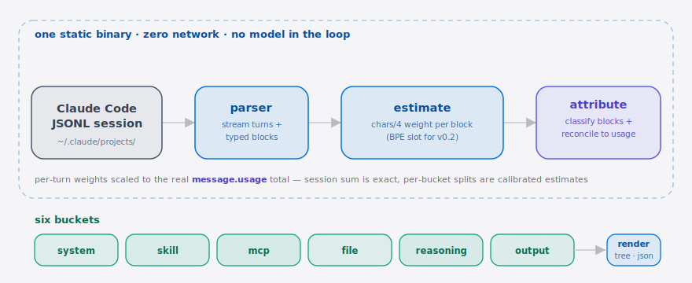

**English** | [简体中文](./README.zh-CN.md)

<p align="center">
  
</p>

<p align="center">
  <a href="LICENSE"></a>
  <a href="https://go.dev/dl/"></a>
  <a href="https://github.com/SuperMarioYL/ctxprof/actions/workflows/ci.yml"></a>
  <a href="https://github.com/SuperMarioYL/ctxprof/releases"></a>
  <a href="#"></a>
  <a href="#"></a>
</p>

<p align="center">
  <b>A context-budget profiler for Claude Code sessions.</b><br/>
  See which skills, MCP tool descriptors, project files, and reasoning ate your 200k-token window — before the next session walks into the same wall.
</p>

---

## Why now

You opened Claude Code, loaded three or four skills you needed last week, wired a couple of MCP servers, started a real task, and at 82% window utilization the assistant told you to start a new chat. You have no idea which of the seven things you added is responsible. The vendor meter shows one aggregate number; [JuliusBrussee/caveman](https://github.com/JuliusBrussee/caveman) (68k★, 1,138 stars/day) trims the model's output style, and [rtk-ai/rtk](https://github.com/rtk-ai/rtk) (58k★) proxies commands — both clever workarounds, neither tells you *what* you were paying for. Meanwhile Uber just capped per-seat AI spend at $1,500/month ([Simon Willison's TIL](https://simonwillison.net/2026/Jun/3/uber-caps-usage/)), so the question of *what is in your context* is now an accounting one as much as a craft one. `ctxprof` is the missing observer: a single static binary that turns Claude Code's flat token total into a structured allocation across **six buckets — system / skill / MCP / file / reasoning / output —** so you can decide what to unload instead of guessing.

##  Architecture

<p align="center">
  <picture>
    <source media="(prefers-color-scheme: dark)" srcset="./assets/atlas-dark.svg">
    <source media="(prefers-color-scheme: light)" srcset="./assets/atlas-light.svg">
    
  </picture>
</p>

A finished Claude Code JSONL session streams through four pure packages — **parser → estimate → attribute → render** — with no network calls and no model in the loop. The source data carries real per-turn `message.usage` totals but **no per-block token field**, so each block gets a local `chars/4` estimate, then `attribute` scales those weights to match the turn's real total: the session sum stays exact while per-bucket splits become calibrated estimates. Every reconciled block lands in one of **six buckets — system / skill / mcp / file / reasoning / output** — which `render` prints as a flame tree or emits as `allocation_v1.json`.

## Table of contents

- [Architecture](#architecture)
- [What you see](#what-you-see)
- [Install](#install)
- [Quickstart (30 seconds)](#quickstart-30-seconds)
- [How it works](#how-it-works)
- [`vs caveman` — adjacent, not a competitor](#vs-caveman--adjacent-not-a-competitor)
- [Configuration](#configuration)
- [Schema: `allocation_v1.json`](#schema-allocation_v1json)
- [Roadmap](#roadmap)
- [Kill criteria (honesty section)](#kill-criteria-honesty-section)
- [Contributing](#contributing)
- [License](#license)
- [Share this](#share-this)

## What you see

```
session 2026-06-04 14:22 — 184,512 / 200,000 tokens (92%)
├── skills        ████████████░░  47,210  (25.6%)
│   ├── caveman              19,840
│   ├── code-review          14,520
│   └── frontend-design       12,850
├── mcp           █████░░░░░░░░░  18,403  (10.0%)
│   ├── pencil                11,201
│   └── shadcn-ui              7,202
├── system prompt █░░░░░░░░░░░░░   4,128  ( 2.2%)
├── files         ████████░░░░░░  31,990  (17.3%)
├── reasoning     ██████████░░░░  62,540  (33.9%)
└── output        ███░░░░░░░░░░░  20,241  (11.0%)
```

##  Demo

<p align="center">
  
</p>

> Rendered in CI by [`docs/demo.tape`](./docs/demo.tape) (vhs) — see [`assets/README.md`](./assets/README.md) for how to re-record it.

## Install

```bash
go install github.com/SuperMarioYL/ctxprof/cmd/ctxprof@latest
```

Or grab a static binary from the [releases page](https://github.com/SuperMarioYL/ctxprof/releases).

## Quickstart (30 seconds)

```bash
# 1. Profile your most recent Claude Code session (auto-discovers ~/.claude/projects/)
ctxprof

# 2. Or point at a specific session file
ctxprof --session ~/.claude/projects/myproj/abc123.jsonl

# 3. Pipe structured allocation to another tool
ctxprof --json | jq '.buckets'

# 4. See exactly what to cut — the largest single consumers across every bucket (read-only)
ctxprof --cut-candidates 10

# 5. See your budget DRIFT over time — per-bucket movement across several sessions
ctxprof trend --since 7d
ctxprof trend session-a.jsonl session-b.jsonl session-c.jsonl --json
```

> **`--cut-candidates N`** appends a ranked list of the N largest named consumers (a skill, an MCP server, a file path) with each one's share of the window — so you know what to trim. It is **diagnosis only**: ctxprof never edits or rewrites a session.
>
> **`ctxprof trend`** profiles several sessions and prints how each bucket's occupancy moves across them (oldest→newest), so creeping system/mcp/file budget is visible at a glance. Pass explicit paths or `--since 7d` to pick recent sessions under `~/.claude/projects/`. `--json` emits an ordered array of `allocation_v1` objects.

<details>
<summary>Sample <code>--json</code> output</summary>

```json
{
  "schema_version": "allocation/v1",
  "session_id": "abc123",
  "window_max": 200000,
  "window_occupancy": 184512,
  "cumulative_tokens": 312880,
  "estimated": true,
  "buckets": {
    "skill":     { "tokens": 47210, "items": [{"name":"caveman","tokens":19840}] },
    "mcp":       { "tokens": 18403, "items": [{"name":"pencil","tokens":11201}] },
    "system":    { "tokens": 4128 },
    "file":      { "tokens": 31990 },
    "reasoning": { "tokens": 62540 },
    "output":    { "tokens": 20241 }
  }
}
```

> Since v0.2 the window-% headline is computed from `window_occupancy` — the peak single-turn footprint — not from a cross-turn cumulative sum (which re-counts the cached prefix each turn). `cumulative_tokens` is reported separately as genuine throughput.

</details>

## How it works

The Claude Code JSONL session log gives you **real per-turn totals** (`message.usage.input_tokens`, `cache_read_input_tokens`, `cache_creation_input_tokens`, `output_tokens`) but **no per-content-block token field**. So bucket numbers cannot be read; they have to be estimated and then reconciled. ctxprof does three things per session:

1. **Estimate** — tokenize each content block locally (a real vendored byte-level BPE tokenizer since v0.2, replacing the v0.1 `chars/4` heuristic).
2. **Reconcile** — for each assistant turn, scale that turn's estimated block weights so they sum to the turn's real `message.usage` total. The session-level sum is therefore exact; per-bucket splits are calibrated estimates, not field reads.
3. **Attribute** — fold each reconciled block weight into one of six buckets by a deterministic, no-model-in-the-loop classifier:

| Block | → Bucket | Why |
| --- | --- | --- |
| `type:thinking` | `reasoning` | The model's internal trace |
| `type:text` (assistant) | `output` | Visible output to the user |
| `tool_use` name = `Read` | `file` | Project content pulled in |
| `tool_use` name = `Skill` | `skill` | `input.command` names the skill |
| `tool_use` name starts `mcp__` | `mcp` | `mcp__<server>__<tool>` |
| `tool_use` anything else (`Bash`, `Edit`, …) | `output` | The model's action surface |
| `tool_result` | `file` | Retrieved content brought back in |
| *(no per-block signal)* | `system` | Approximated from first-turn `cache_creation_input_tokens` |

Four packages, one static binary, zero network calls:

```
cmd/ctxprof → internal/parser → internal/estimate → internal/attribute → internal/render
  (cobra)      (JSONL stream)    (chars/4 weights)   (classify+reconcile)  (tree | json)
```

## `vs caveman` — adjacent, not a competitor

[`caveman`](https://github.com/JuliusBrussee/caveman) and [`rtk`](https://github.com/rtk-ai/rtk) are token *savers*. ctxprof is a token *observer*. They're complementary, not competing:

| | ctxprof | caveman | claude `--stats` |
| --- | :---: | :---: | :---: |
| Shows total window usage | ✓ | partial | ✓ |
| Attributes tokens to skills | ✓ | — | — |
| Attributes tokens to MCP descriptors | ✓ | — | — |
| Attributes tokens to reasoning trace | ✓ | — | — |
| Actively reduces token usage | — | ✓ | — |
| Rewrites the model's output style | — | ✓ | — |
| Single static binary, no install of an agent | ✓ | — | ✓ |
| Open schema other tools can emit | ✓ | — | — |

If you already use caveman, ctxprof tells you *what caveman is saving you from*. If a session has been profiled before and after a skill is unloaded, you get a falsifiable answer to "was it worth installing?"

## Configuration

No config file in v0.1 — every knob is a flag:

| Flag | Type | Default | Meaning |
| --- | --- | --- | --- |
| *(positional)* | path | — | JSONL session file to profile |
| `--session` | path | — | Same as positional, kept for scripting clarity |
| `--json` | bool | `false` | Emit `allocation_v1.json` to stdout instead of the tree |
| `--no-color` | bool | `false` | Disable ANSI colors (use this when piping to `less`) |
| `--window-max` | int | `200000` | Context window size used for the percentage math |

With no args, ctxprof scans `~/.claude/projects/` and picks the most recent `.jsonl`.

## Schema: `allocation_v1.json`

The JSON shape is the moat. If Codex / Aider / Cursor ever want to emit "what's in the context," they can publish the same schema — and ctxprof becomes a renderer over a shared spec instead of a Claude Code-only tool. The schema lives at [`internal/schema/allocation_v1.json`](./internal/schema/allocation_v1.json); it's small enough to read end-to-end in five minutes.

PRs that add a second harness's emitter are explicitly welcome — that's how this stops being a one-vendor tool.

## Roadmap

- [x] **m1 — parse_session.** Stream the JSONL and emit per-turn records carrying the real `message.usage` totals plus typed content blocks with locally-estimated weights.
- [x] **m2 — attribute_buckets.** Six-bucket classifier + per-turn reconciliation; session-level sum is exact, per-bucket splits are calibrated estimates.
- [x] **m3 — render_treemap.** Flame-graph-style tree to a true-color terminal, plus `--json` emitting `allocation_v1.json`.
- [x] **v0.2 — BPE tokenizer.** Replaced `chars/4` with a real vendored byte-level BPE tokenizer for tighter pre-reconciliation estimates.
- [x] **v0.3 — multi-session trend.** `ctxprof trend` shows per-bucket budget drift across several sessions — "what changed between this run and last week's?"
- [x] **v0.3 — cut-candidates.** `--cut-candidates N` ranks the largest single consumers across every bucket so you see what to trim (read-only diagnosis, never an automated edit).
- [ ] **v0.x — second-harness parser.** Codex or Aider, depending on which OSS maintainer says yes first.
- [ ] **v0.x — CI mode.** Fail a build if the context allocation exceeds a budget. Driven by inbound team-plan demand, not built speculatively.

Explicitly **not** on the roadmap: web UI, real-time tail mode, cost-in-dollars conversion, auto-edit/auto-rewrite of a session (cut-candidates only *diagnoses*), hosted SaaS. See [§6 of the MVP plan](#) if you want the full out-of-scope list.

## Kill criteria (honesty section)

This project will be **shut down** if, 30 days after the v0.1 tag:

- the repo has < 250 stars, AND
- fewer than 5 organic issues opened by non-launch-channel users, AND
- no community contributor has added a second harness parser.

Or earlier if Anthropic ships a native "what's in your context" status-line panel — at that point ctxprof pivots to a schema-only spec repo, and the binary is archived. Better to admit it than to keep a zombie around.

## Contributing

Issues and PRs welcome — especially:

1. **Classifier rules** for tool names that should attribute differently (open an issue with a fixture).
2. **A second harness's parser** (Codex / Aider / Cursor). Match the `allocation_v1.json` schema and ctxprof renders the tree for free.
3. **Real session fixtures** (redacted) so the test suite catches edge cases other people hit first.

The classifier is in [`internal/attribute/classifier.go`](./internal/attribute/classifier.go); tests are table-driven, so a new rule is one PR with one row.

## License

[MIT](./LICENSE) — do whatever you want, attribution appreciated, no warranty.

## Share this

```
ctxprof — the context-budget profiler for Claude Code.
See which skills, MCP tools, files & reasoning ate your 200k window.
Single static Go binary. MIT. https://github.com/SuperMarioYL/ctxprof
```

After pushing the repo, set GitHub topics to help discovery:

```bash
gh repo edit --add-topic claude-code --add-topic mcp --add-topic profiler \
             --add-topic context-window --add-topic developer-tools
```
