[English](./README.md) · [Website](https://ctxprof.lei6393.com) · [GitHub](https://github.com/SuperMarioYL/ctxprof)

<picture>
  <source media="(max-width: 600px) and (prefers-color-scheme: dark)" srcset="./assets/presentation/hero-mobile-dark.svg">
  <source media="(max-width: 600px)" srcset="./assets/presentation/hero-mobile-light.svg">
  <source media="(prefers-color-scheme: dark)" srcset="./assets/presentation/hero-dark.svg">
  
</picture>

# ctxprof

**看清上下文窗口被什么占用。**

ctxprof 读取 Claude Code 会话日志，将记录的用量归因到系统、Skill、MCP、文件、推理和输出六类。

## 为什么需要它

总用量无法指出应当检查哪些已加载内容。归因排行帮助定位较大消费者，并在调整工作流前比较不同会话。

- **六类用量归因** — 检查系统、Skill、MCP、文件、推理和输出。
- **区分峰值与吞吐** — 累计重复前缀与窗口容量分别展示。
- **先比较再精简** — trend 与 compare 可分析明确指定的会话文件。

## 架构

<picture>
  <source media="(max-width: 600px) and (prefers-color-scheme: dark)" srcset="./assets/presentation/architecture-mobile-dark.svg">
  <source media="(max-width: 600px)" srcset="./assets/presentation/architecture-mobile-light.svg">
  <source media="(prefers-color-scheme: dark)" srcset="./assets/presentation/architecture-dark.svg">
  
</picture>

解析器读取 JSONL 轮次，内置字节级 BPE 为各内容块估算权重，再对齐到日志中的用量。归因层把结果分入六类，渲染层区分单轮峰值窗口占用与跨轮累计吞吐。

| 组件 | 职责 |
| --- | --- |
| `Session parser` | internal/parser |
| `Local BPE` | internal/estimate |
| `Reconciliation` | internal/attribute |
| `Tree / JSON` | internal/render |

## 安装与快速上手

使用仓库清单指定的运行时版本构建，并在仓库根目录运行示例。

```bash
git clone https://github.com/SuperMarioYL/ctxprof.git
cd ctxprof
go build ./cmd/ctxprof
```

读取 examples/sample-session.jsonl 中的完整合成会话，并输出归因树。

```bash
go run ./cmd/ctxprof --session examples/sample-session.jsonl
```

## 实际运行示例

<picture>
  <source media="(max-width: 600px) and (prefers-color-scheme: dark)" srcset="./assets/presentation/process-mobile-dark.svg">
  <source media="(max-width: 600px)" srcset="./assets/presentation/process-mobile-light.svg">
  <source media="(prefers-color-scheme: dark)" srcset="./assets/presentation/process-dark.svg">
  
</picture>

The recorded output separates window occupancy from cumulative tokens and displays estimated bucket shares.

```text
session 01J0Z5K3X4SAMPLEPROFILE — 23,180 / 200,000 tokens (12% of window, peak single-turn footprint)
  46,200 tokens cumulative throughput (re-counts the cached prefix each turn; not window occupancy)
├── system     ░░░░░░░░░░░░░░     1,050  (2.3%) ~
├── skill      █░░░░░░░░░░░░░     3,768  (8.2%)
│   └── caveman                         3,768
├── mcp        █████░░░░░░░░░    18,508  (40.1%) ~
│   └── grafana                        15,358
├── file       █░░░░░░░░░░░░░     4,337  (9.4%)
│   └── docs/incidents/2026-05.md       4,337
├── reasoning  ███░░░░░░░░░░░     9,945  (21.5%)
└── output     ██░░░░░░░░░░░░     8,592  (18.6%)

note: bucket numbers are calibrated estimates reconciled to real per-turn message.usage totals.
      rows marked ~ (system, mcp) are approximated from the first turn's cache_creation_input_tokens.
```

完整命令与输出保存在 [docs/demo-results.json](./docs/demo-results.json). 输入和复现代码均随仓提供。


保留已有录制供参考；上方文字示例给出当前可复现的操作。

## 用法

CLI 提供以下操作。示例之外的命令需要替换成你的文件路径或标识。

```bash
go run ./cmd/ctxprof --session examples/sample-session.jsonl --json
go run ./cmd/ctxprof --session examples/sample-session.jsonl --cut-candidates 10
# Compare your own sessions, old first:
ctxprof compare old.jsonl new.jsonl --json
ctxprof trend session-a.jsonl session-b.jsonl
```

## 配置

--session 显式指定文件；省略时从 ~/.claude/projects/ 查找会话。--window-max 设置窗口分母，--json 输出结构化结果，--cut-candidates N 列出较大的单项消费者。

## 集成与职责分工

<picture>
  <source media="(max-width: 600px) and (prefers-color-scheme: dark)" srcset="./assets/presentation/integrations-mobile-dark.svg">
  <source media="(max-width: 600px)" srcset="./assets/presentation/integrations-mobile-light.svg">
  <source media="(prefers-color-scheme: dark)" srcset="./assets/presentation/integrations-dark.svg">
  
</picture>

以下路径已有源码实现。按任务选择输入，并把生成的结果与项目一起保存。

| 路径 | 已实现职责 |
| --- | --- |
| Claude JSONL | Recorded turns and usage |
| allocation/v1 | Structured allocation output |
| Trend / compare | Read-only session comparison |
| Terminal tree | Largest context consumers |

## 限制与后续方向

- 内容块和分类值是校准后的估计，内置 tokenizer 不是 Anthropic 专有 tokenizer。
- 示例为合成会话；用量数字来自固定输入，不是实测节省量。
- ctxprof 诊断已记录数据，不会卸载 Skill 或修改会话。

后续可用有代表性的日志改进归因质量，同时保留明确的 estimated 标记与只读工作流。

## 许可与贡献

许可见 [LICENSE](./LICENSE). 反馈问题时请提供最小输入、执行命令和实际输出。
